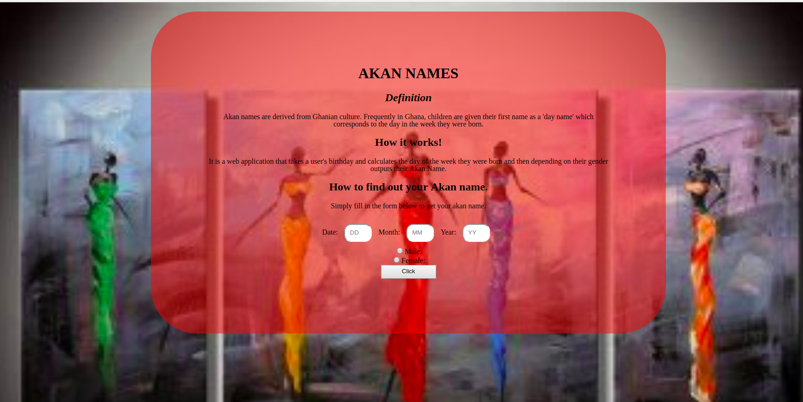
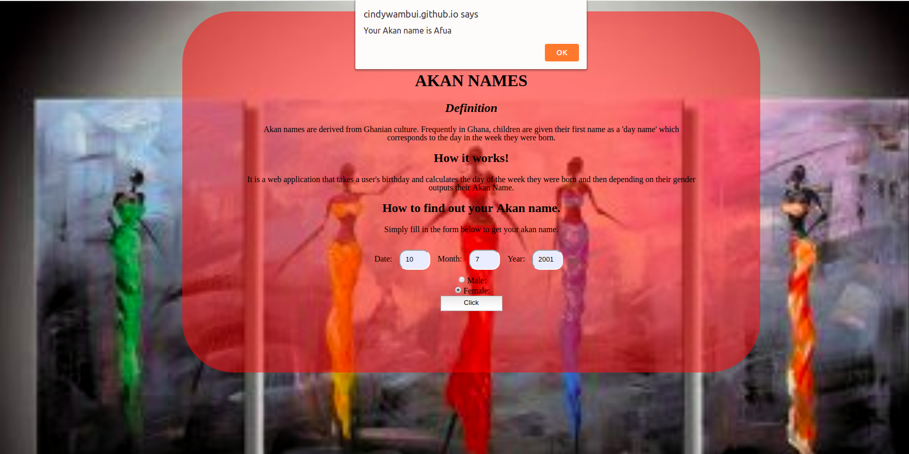

# AKAN NAME
#### A web application, 16nth August 2019
#### By **Cindy Wambui**
## Description
This is  a web application that takes a user's birthday and calculates the day of the week they were born and then depending on their gender outputs their Akan Name using javascript. 

## A sample screenshot of the application

This is the landing page for the URL.

This is the alert that comes after the user types in their details.

## Behaviour Driven Development

| Behaviour  | input |  output |
| ------------ | ------------- | ------------ |
| Page loads | User clicks the submit button without filling the form | An error box is displayed to the user. |

## Setup/Installation Requirements
****
Using a desktop or laptop,a phone and a tablet.
****
## Installation requirements

- Clone to the given URl:https://github.com/Cindywambui/akan-name
- unzip the downloaded file.
- Open the index.html using any other browser.
## Technologies Used
- HTML
- CSS
- Javascript
## Support and contact details
- Github account : Cindywambui
- Live link : https://cindywambui.github.io/akan-name/
- Primary email :@montanacindy5@gmail.com
### License
 MIT 
- Copyright (c) 2019 
- Permission is hereby granted, free of charge, to any person obtaining a copy of this software and associated documentation files (the "Software"), to deal in the Software without restriction, including without limitation the rights to use, copy, modify, merge, publish, distribute, sublicense, and/or sell copies of the Software, and to permit persons to whom the Software is furnished to do so, subject to the following conditions:

The above copyright notice and this permission notice shall be included in all copies or substantial portions of the Software.

THE SOFTWARE IS PROVIDED "AS IS", WITHOUT WARRANTY OF ANY KIND, EXPRESS OR IMPLIED, INCLUDING BUT NOT LIMITED TO THE WARRANTIES OF MERCHANTABILITY, FITNESS FOR A PARTICULAR PURPOSE AND NONINFRINGEMENT. IN NO EVENT SHALL THE AUTHORS OR COPYRIGHT HOLDERS BE LIABLE FOR ANY CLAIM, DAMAGES OR OTHER LIABILITY, WHETHER IN AN ACTION OF CONTRACT, TORT OR OTHERWISE, ARISING FROM, OUT OF OR IN CONNECTION WITH THE SOFTWARE OR THE USE OR OTHER DEALINGS IN THE SOFTWARE.

